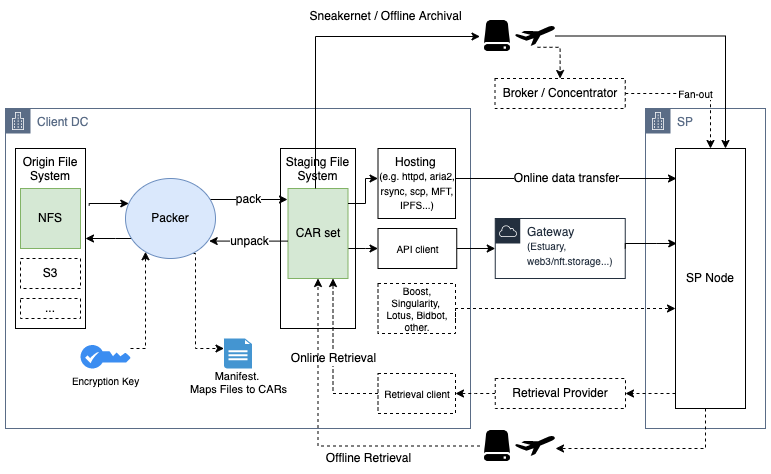

# Packer.

[](https://circleci.com/gh/frank-ang/packer/tree/test)

Utility to perform packaging of files for Filecoin deals. Performs: file encryption, large file splitting, and generation of CAR files, in preparation of data storage movement. After data retrieval from Filecoin, performs: CAR file extraction, large file reassembly, file decryption.





# Objective.

To provide a tool for packaging large potentially proprietary data sets into the Filecoin network. Objective is to reduce friction for data movement, across both online deal and offline deal paths.

## Benefits:
* Standardization of packaging toolset for large proprietary data sets scenarios.
* Removes lower-level undifferentiated heavy lifting, that the Filecoin ecosystem can reuse in multiple contexts such as "Data storage broker", "Data storage concentrator" e.g. Estuary, Sneakernet provider, Data Client using DIY offline path.

## Supported source storage system types (for MVP):
* POSIX NFS / DASD file system.

Future/Backlog options to support additional sources, particularly cloud object storage:
* Amazon S3, and S3-compatible cloud object storage.
* Azure Blob Storage
* Google Cloud Storage
* Alibaba Cloud Object Storage Service
* Huawei Cloud Object Storage Service

## Encryption / Decryption

Cryptographic methods:
* RSA AES CBC (keypair)

Cryptographic methods TODO:
* RSA AES CBC (symmetric)
* GnuPGP

## Testing & Benchmarking

Post-MVP, it will be essential to run scalability tests and benchmarks.  

# Usage:

```
NAME
    packer - Filecoin filesystem packager/unpackager

SYNOPSIS

    python packer.py [-p|-u] [-s SOURCE_PATH] [-t TEMP_PATH] [-o OUTPUT_PATH] [-b BIN_SIZE] [-k ENCRYPTION_KEY]

OPTIONS

    -p, --pack
        pack mode

    -u, --unpack
        unpack mode

    -s SOURCE_PATH, --source SOURCE_PATH
        During packing, the path to the pre-packed source data.
        During unpacking, the path containing CAR files of packed data.

    -t TEMP_PATH, --temp TEMP_PATH
        Path to temporary staging directory. 

    -o OUTPUT_PATH, --output OUTPUT_PATH
        Path to write final output of packaged or unpackaged content.
        
    -b BIN_SIZE, --bin BIN_SIZE
        BIN_SIZE in bytes, default 32GB

    -k, --key
        Encryption certificate or private key.

    -h, --help
        help
```


# Installation

## Prerequisites

Ensure dependencies are installed.
* Linux OS (tested on Ubuntu and MacOS)
* Python 3.10+
* Rsync
* NodeJS ipfs-car

```bash
sudo apt-get update -y
sudo apt-get install -y rsync
sudo npm install -g ipfs-car
pip install -r requirements.txt
```

## Install.

Clone this repo.

# Encryption Keys

Packer currently uses RSA AES encryption. Bring your own keys, or generate a key pair (explained below). 

Users are responsible for observing key management best-practices, please store your keys securely.

## Generate private key and public certificate.

Interactive
```
openssl req -x509 -nodes -days 36500 -newkey rsa:2048 -keyout private_key.pem -out certificate.pem
```

Non-interactive:
```
openssl req -x509 -nodes -days 36500 -newkey rsa:2048 -keyout private_key.pem -out certificate.pem -subj "/C=ZZ/O=protocol.ai/OU=outercore/CN=packer"
```

# Backlog / Caveats

## Backlog Improvements:
* AWS Packer AMI with CloudFormation template using IAM instance profile for EFS use-case, on-prem NFS via DX use-case, S3 use-case.
* S3 support.
* Compression.
* Filename / dirname obfuscation. (current implementation is in clear)
* Output manifest of file-car mappings.

See [issues](https://github.com/frank-ang/packer/issues).

## CAVEATS & NOT SUPPORTED:

* Path names are transparently stored in CAR files. Individual files are encrypted, but filesystem path names are stored in clear. User is responsible for ensuring source filesystem pathnames are hidden (e.g. preprocess all data into TAR files), obfuscated, or otherwise does not contain privacy information.
* POSIX metadata (e.g. mtime) are discarded since CAR files do not preserve file metadata. Workaround is for the user to preprocess all data into TAR files (same workaround as for path name privacy)


# License

This project is licensed under the terms of the [MIT](./LICENSE) license.

